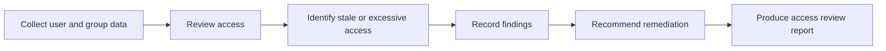

# IAM Access Review Mini Project

## Overview

This project demonstrates a basic Identity and Access Management access review.

The goal is to identify stale accounts, excessive access, privileged access concerns, and least privilege improvement opportunities.

---

## Skills Demonstrated

- Identity and Access Management review process
- Least privilege analysis
- Stale account identification
- User and group review
- Privileged access review
- Evidence logging
- Risk-based findings
- Access review reporting

---

## Access Review Scope

| Area | Review Objective |
|---|---|
| Users | Confirm active, disabled, and stale accounts |
| Groups | Review group purpose and membership |
| Privileged Roles | Check elevated access |
| Licences | Identify possible licence waste |
| Access Findings | Record risks and recommendations |

---

## Review Method

---

# Access Review Findings Register

| Finding ID | Area | Finding | Risk | Severity | Recommendation | Status |
|---|---|---|---|---|---|---|
| IAM-001 | Stale account | Example user account appears inactive | Former or inactive access may remain available | Medium | Disable or review account ownership | Open |
| IAM-002 | Group access | Group purpose unclear | Access may be assigned without business justification | Medium | Document group owner and purpose | Open |
| IAM-003 | Privileged access | Admin role requires review | Excessive privilege risk | High | Confirm approval and reduce access where possible | Open |

---

*Security and Privacy Notice*

*This repository is for portfolio and lab demonstration purposes only.*

*It does not contain:*

- *Real business data*
- *Live customer data*
- *Passwords*
- *Access tokens*
- *Tenant secrets*
- *Private keys*
- *Full tenant IDs*
- *Unredacted email addresses*
- *Confidential screenshots*

*All screenshots and examples are redacted before publication.*
